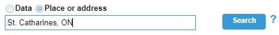
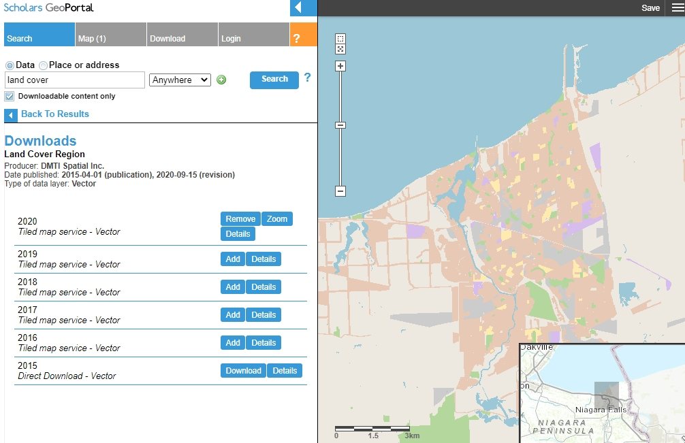
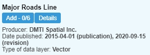
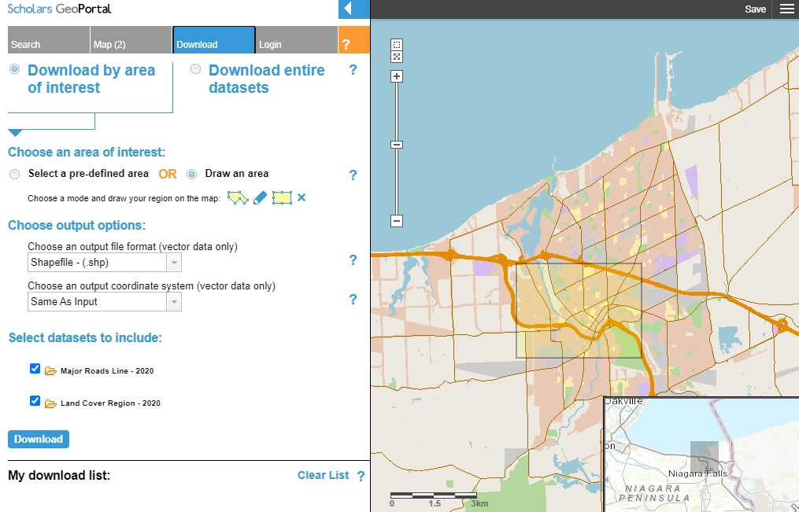
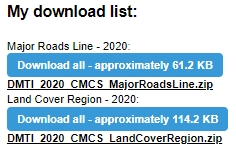
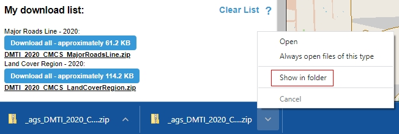
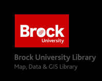

# Scholars GeoPortal - How to...
The following is a brief tutorial guiding the user through search and download steps using Scholars GeoPortal, a search and discovery platform directed towards Ontario Universities.

### Navigating the Portal
1. Go to [http://geo.scholarsportal.info/](http://geo.scholarsportal.info/)
2. If you are accessing the geoportal off-campus, click the login link at the top, middle of the page. Select your institution and sign in using your credentials.
3. Select the Place or Address search option and enter "St. Catharines, ON".
4. Click Search.

    

5. Click ZOOM for the geocoded result. The map zooms to the St. Catharines area.
6. Select the Data search option and enter a keyword, such as "land cover".
7. Click Search.
8. From the results list, find "Land Cover Region"
9. Click the blue DETAILS button to access metadata about the resource. 
10. Click the blue button below the data title "Add-1/6"
11. Add the 2020 data layer. When prompted with the Conditions of Use statement, click Accept to continue.

      
    
12. Click "Back to Results" below the search window.
13. Enter a new search term in the search window (i.e. "roads").
14. Find the layer named "Major Roads Line" and add the 2020 layer to the map.

      
    
15. Repeat the above steps to search, browse and add data layers to the map.

### Downloading data

1. Click the Download tab.
2. Select "Download by area of interest".
3. Select "Draw an area".
4. Use the rectangle tool to draw a box on the map view. If you want to define a new selection area, click the X beside the rectangle tool to clear the map.

    
    
5. Click the blue Download button. Depending on the number of layers, this could take several minutes.
6. The options for downloading clipped data will appear in the "My Download List"

    
    
7. Click each zip file in turn to download the data to your local DOWNLOADS directory.

### Unzipping a file

1. If you are using Chrome, click the UP arrow beside the downloaded file (at the bottom of the window) and click "Show in Folder".
 
     
     
2. Right-click the zip folder and select "Extract all". You can identify an appropriate location or accept the default (MY DOWNLOADS).
3. Run your GIS software and add the files according to your workflow.

A detailed User Guide is available here [https://learn.scholarsportal.info/all-guides/geoportal/usinggeoportal/](https://learn.scholarsportal.info/all-guides/geoportal/usinggeoportal/)

---
  
 
This tutorial is brought to you by the [Brock University Map, Data & GIS Library](https://brocku.ca/library/mdgl/)  E-mail us at [maplib@brocku.ca](mailto:maplib@brocku.ca)
  
You can also find us on:  
[Facebook](https://www.facebook.com/Brock-University-Map-Data-GIS-Library-107927255178257)  
[Twitter](https://twitter.com/BrockU_MDGL)  
[Instagram](https://www.instagram.com/brockmdgl/)   
 

<!--- Please use reference style images so that it is easier to update pictures later --->

